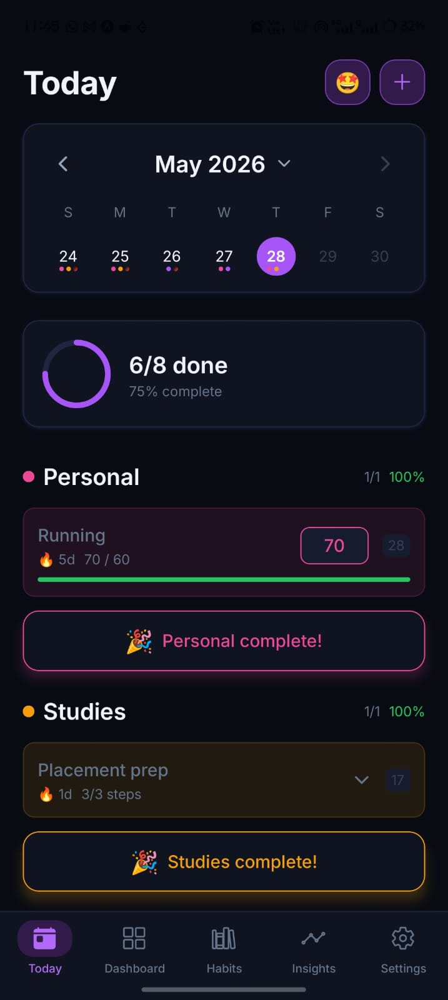
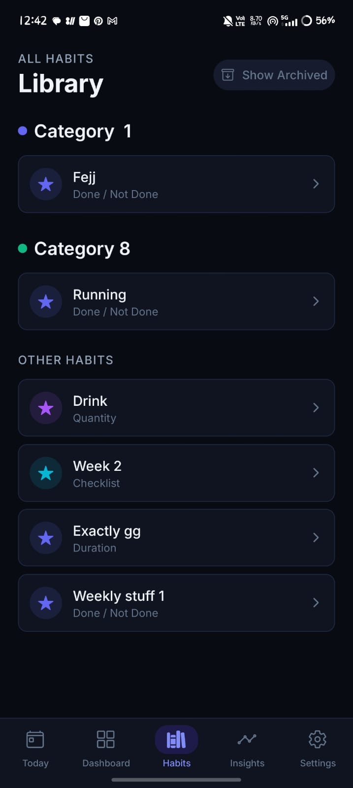

<div id="readme-top" align="center">


  <h1>HabitVault</h1>

  
  
  <p>A beautiful, offline-first habit tracking application designed to help you build and sustain powerful daily routines.</p>
  
   <!-- Badges -->
  <!-- <p>
    <a href="https://github.com/Adhik-6/Habit_Vault">
      
    </a>
    <a href="https://github.com/Adhik-6/Habit_Vault/issues/">
      
    </a>
    <a href="https://github.com/Adhik-6/Habit_Vault/blob/master/LICENSE">
      
    </a>
  </p>

  <!-- Links -->
  <h4>
    <!-- <a href="https://github.com/Adhik-6/Habit_Vault">Documentation</a> -->
    <!-- <span> · </span> -->
    <a href="https://github.com/Adhik-6/Habit_Vault/issues/">Report Bug</a>
    <span> · </span>
    <a href="https://github.com/Adhik-6/Habit_Vault/issues/">Request Feature</a>
  </h4> 

</div>

<p align="center">HabitVault is a comprehensive, offline-first mobile application built to seamlessly integrate into your daily life. It features a cinematic dark mode, dynamic dashboards, rich analytics, and an intuitive library to organize all your habits effectively.</p>

<br />

<!-- Table of Contents -->
# :notebook_with_decorative_cover: Table of Contents <!-- omit in toc -->

- [:star2: About the Project](#star2-about-the-project)
  - [:camera: Screenshots](#camera-screenshots)
  - [:space\_invader: Tech Stack](#space_invader-tech-stack)
  - [🛠️ Tech Stack](#️-tech-stack)
  - [:dart: Features](#dart-features)
- [:toolbox: Getting Started](#toolbox-getting-started)
  - [:bangbang: Prerequisites](#bangbang-prerequisites)
  - [:key: Environment Variables](#key-environment-variables)
  - [:gear: Installation](#gear-installation)
  - [:test\_tube: Running Tests](#test_tube-running-tests)
  - [:running: Run Locally](#running-run-locally)
  - [:triangular\_flag\_on\_post: Deployment](#triangular_flag_on_post-deployment)
- [:eyes: Usage](#eyes-usage)
- [:compass: Roadmap](#compass-roadmap)
- [:wave: Contributing](#wave-contributing)
- [:grey\_question: FAQ](#grey_question-faq)
- [:warning: License](#warning-license)
- [:handshake: Contact](#handshake-contact)
- [:gem: Acknowledgements](#gem-acknowledgements)

<!-- About the Project -->
## :star2: About the Project

Building sustainable habits requires a system that is both engaging and frictionless. HabitVault was created to give you deep insights into your routines without compromising on aesthetics or performance. Unlike cloud-dependent applications, HabitVault operates entirely locally, guaranteeing total privacy and lightning-fast responses. 

<!-- Screenshots -->
### :camera: Screenshots

<div align="center" style="margin-bottom: 80px;">
  <div style="margin-bottom: 40px;">
    <h3>Home & Dashboard</h3>
    <p>
      
      
    </p>
  </div>
</div>

> 📁 More screenshots are available in the [screenshots folder](./screenshots)

<!-- TechStack -->
### :space_invader: Tech Stack

* [![React Native][ReactNative]][ReactNative-url]
* [![Expo][Expo]][Expo-url]
* [![TypeScript][TypeScript]][TypeScript-url]
* [![SQLite][SQLite]][SQLite-url]

### 🛠️ Tech Stack

| Platform       | Technologies Used                                |
|----------------|--------------------------------------------------|
| Frontend       | React Native, Expo Router                        |
| State          | Zustand                                          |
| Database       | expo-sqlite (Local First)                        |
| Animations     | React Native Reanimated                          |
| UI / Styling   | Custom Tokens (Cinematic Dark Mode), NativeWind  |

<!-- Features -->
### :dart: Features

- **Dynamic Tracking:** Log boolean habits, quantitative habits (minutes, pages), or composite checklists.
- **Unified Dashboard:** Collapsible 7-day strip or full monthly calendar view with progress rings.
- **Categorization System:** Group your habits into custom categories with unique icons and colors.
- **Rich Analytics:**
  - Activity Heatmaps.
  - Streak tracking (Current & Longest).
  - 30-Day "Strength Score".
  - Mood vs. Habit completion trend line charts.
- **Offline First:** 100% local data storage ensuring instantaneous speed and total privacy.
- **Data Portability:** Export your entire history to a CSV file natively via your OS Share Sheet.

<!-- Getting Started -->
## 	:toolbox: Getting Started

### :bangbang: Prerequisites

Ensure you have the following installed:
- Node.js (v18+)
- npm or yarn
- Expo CLI
- Expo Go App (on iOS or Android)

### :key: Environment Variables

Since HabitVault is a fully offline, local-first application, there are no mandatory environment variables required to run the application in its base state. 

### :gear: Installation

Clone the repository and install the dependencies:

```bash
  git clone https://github.com/Adhik-6/Habit_Vault.git
  cd habit_tracker
  npm install
```
   
### :test_tube: Running Tests

Currently, the project relies on strict static analysis via TypeScript. Run the type checker with:

```bash
  npx tsc --noEmit
```

### :running: Run Locally

Start the Expo development server:

```bash
  npm start
```
Scan the generated QR code with your Expo Go app (Android) or default Camera app (iOS) to launch the app on your physical device. Alternatively, press `i` to open in the iOS Simulator or `a` to open in the Android Emulator.

### :triangular_flag_on_post: Deployment

To build a production standalone application (APK/AAB or IPA), use EAS Build:

```bash
  npx eas build --profile production
```

<!-- Usage -->
## :eyes: Usage

HabitVault is designed to be highly intuitive:
1. **Home:** Use the dynamic calendar to view past dates or plan future ones. Tap the '+' button in the header to create a new habit.
2. **Library:** Navigate to the "Habits" tab to view all your active and archived habits categorized neatly.
3. **Dashboards:** Tap any widget or habit to view deep-dive analytics, edit its rules, or archive it.
4. **Insights:** Check the Insights tab to see your overall app performance, strength scores, and mood trends.

<!-- ROADMAP -->
## :compass: Roadmap

- [x] Initial SQLite architecture and core CRUD operations.
- [x] Complex Analytics (Heatmaps, Streaks, Strength Scores).
- [x] Category Grouping & Navigation Overhaul.
- [x] CSV Export via Native Share Sheets.
- [ ] Cross-device synchronization (Optional Cloud Sync).
- [ ] Lock-screen Widgets (iOS/Android).
- [ ] Habit Reminders & Notifications.

See the [open issues](https://github.com/Adhik-6/Habit_Vault/issues) for a full list of proposed features (and known issues).

<!-- CONTRIBUTING -->
## :wave: Contributing

Contributions are what make the open source community such an amazing place to learn, inspire, and create. Any contributions you make are **greatly appreciated**.

1. Fork the Project
2. Create your Feature Branch (`git checkout -b feature/AmazingFeature`)
3. Commit your Changes (`git commit -m 'Add some AmazingFeature'`)
4. Push to the Branch (`git push origin feature/AmazingFeature`)
5. Open a Pull Request

<!-- ### Top contributors

<a href="https://github.com/Adhik-6/Habit_Vault/graphs/contributors">
  
</a> -->

<!-- FAQ -->
## :grey_question: FAQ

<details>
  <summary>Is my data stored securely?</summary>

  Yes! HabitVault is 100% offline-first. Your habit data is stored securely in an SQLite database directly on your device. Nothing is sent to an external server.
</details>

<details>
  <summary>How do I restore an archived habit?</summary>

  Navigate to the **Habits** library tab, tap the **"Show Archived"** button at the top, select your archived habit, and tap **"Unarchive Habit"** at the bottom of its dashboard.
</details>

<!-- License -->
## :warning: License

Distributed under the MIT License. See `LICENSE.txt` for more information.

<!-- Contact -->
## :handshake: Contact

Adhik - [@Adhik-6](https://github.com/Adhik-6)

Project Link: [https://github.com/Adhik-6/Habit_Vault](https://github.com/Adhik-6/Habit_Vault)

<!-- Acknowledgments -->
## :gem: Acknowledgements

 - [Expo](https://expo.dev/)
 - [React Native Reanimated](https://docs.swmansion.com/react-native-reanimated/)
 - [Zustand](https://github.com/pmndrs/zustand)
 - [React Native SVG](https://github.com/software-mansion/react-native-svg)
 - [Antigravity](https://antigravity.google/)

<p align="right">(<a href="#readme-top">back to top</a>)</p>

[ReactNative]: https://img.shields.io/badge/React_Native-20232A?style=for-the-badge&logo=react&logoColor=61DAFB
[ReactNative-url]: https://reactnative.dev/
[Expo]: https://img.shields.io/badge/Expo-000000?style=for-the-badge&logo=expo&logoColor=white
[Expo-url]: https://expo.dev/
[TypeScript]: https://img.shields.io/badge/TypeScript-007ACC?style=for-the-badge&logo=typescript&logoColor=white
[TypeScript-url]: https://www.typescriptlang.org/
[SQLite]: https://img.shields.io/badge/SQLite-003B57?style=for-the-badge&logo=sqlite&logoColor=white
[SQLite-url]: https://sqlite.org/